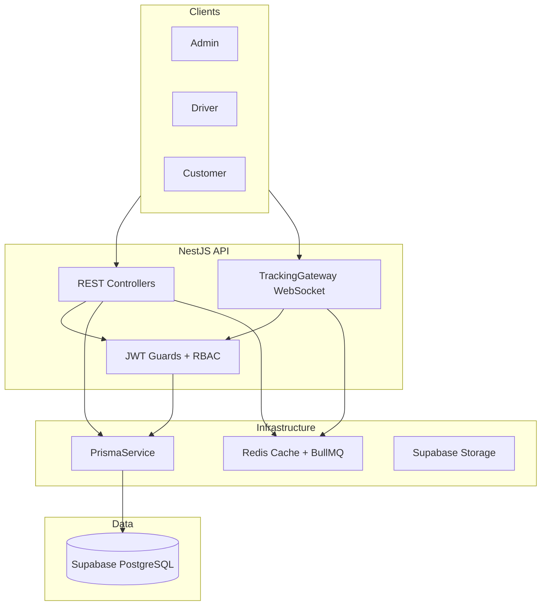

# Delivery Logistics API

Backend logistics system for managing deliveries, drivers, and real-time shipment tracking.

## Tech Stack

- **Backend:** NestJS
- **Database:** Supabase PostgreSQL + Prisma ORM
- **Auth:** JWT + bcrypt
- **Realtime:** WebSockets (Socket.IO)
- **Cache/Queue:** Upstash Redis + BullMQ
- **Storage:** Supabase Storage
- **CI:** GitHub Actions

## Target architecture



## Prerequisites

- Node.js 20+
- pnpm
- [Supabase](https://supabase.com) project
- [Upstash](https://upstash.com) Redis database

## Quick Start

```bash
# 1. Install dependencies
pnpm install

# 2. Configure environment (Supabase + Upstash credentials)
cp .env.example .env

# 3. Run database migrations against Supabase
pnpm prisma:migrate

# To create NEW migrations during development:
# pnpm prisma:migrate:dev

# 4. Seed development data
pnpm prisma:seed

# 5. Start dev server
pnpm start:dev
```

API runs at `http://localhost:3000/api/v1`  
Swagger docs at `http://localhost:3000/docs`

## Environment Variables

| Variable | Source |
|----------|--------|
| `DATABASE_URL` | Supabase → Database → Connection string → **Session pooler** (port 5432) |
| `REDIS_URL` | Upstash → Redis database → Redis URL (`rediss://...`) |
| `SUPABASE_URL` | Supabase → Project Settings → API → Project URL |
| `SUPABASE_SERVICE_ROLE_KEY` | Supabase → Project Settings → API → service_role key |

## Seed Users

| Role     | Email                 | Password     |
|----------|-----------------------|--------------|
| Admin    | admin@leo.com        | password123  |
| Driver   | driver@leo.com       | password123  |
| Customer | customer@leo.com  | password123  |

## Module Map

| Module          | Description                              |
|-----------------|------------------------------------------|
| `auth`          | Register, login, JWT                     |
| `users`         | User management                          |
| `companies`     | Multi-tenant company scope               |
| `drivers`       | Driver profiles & availability           |
| `shipments`     | Delivery orders & status lifecycle       |
| `tracking`      | WebSocket live location tracking         |
| `notifications` | In-app notifications + BullMQ queue      |
| `analytics`     | Admin dashboard metrics                  |
| `health`        | DB + Redis health check                  |

## Roles

- **Admin** — manages shipments, assigns drivers, views analytics
- **Driver** — receives deliveries, updates status, sends GPS updates
- **Customer** — tracks shipments, views delivery history

## Scripts

```bash
pnpm start:dev          # Dev server with hot reload
pnpm build              # Production build
pnpm test               # Unit tests
pnpm test:e2e           # E2E tests
pnpm lint               # ESLint
pnpm prisma:generate    # Generate Prisma client
pnpm prisma:migrate     # Run migrations (against Supabase)
pnpm prisma:studio      # Prisma Studio GUI
pnpm prisma:seed        # Seed database
```

## WebSocket Tracking

Connect to namespace `/tracking`:

```javascript
// Join shipment room
socket.emit('joinShipment', { trackingCode: 'ABCD1234' });

// Driver sends location (broadcast to room)
socket.emit('driverLocation', {
  trackingCode: 'ABCD1234',
  shipmentId: '...',
  driverId: '...',
  lat: 40.7128,
  lng: -74.006,
});
```

## Project Structure

```
src/
├── config/           # Environment configuration
├── common/           # Guards, decorators, filters, enums
├── database/         # Prisma service
├── infrastructure/   # Redis, BullMQ, Supabase Storage
└── modules/          # Feature modules
```
