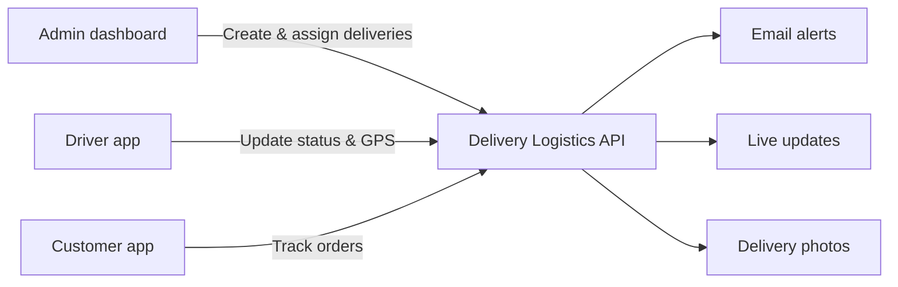
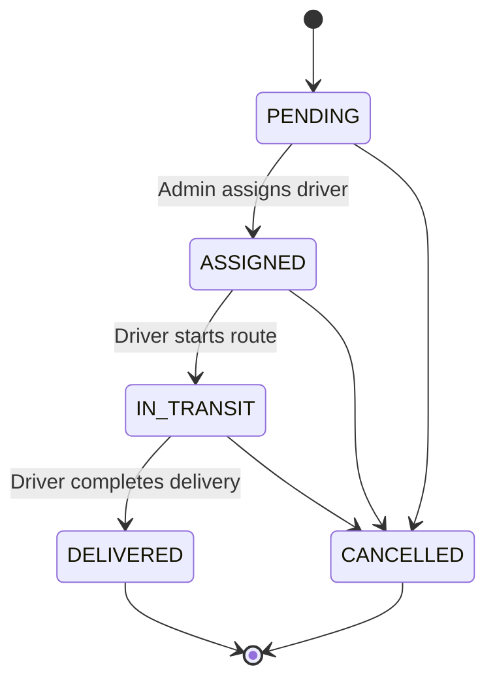
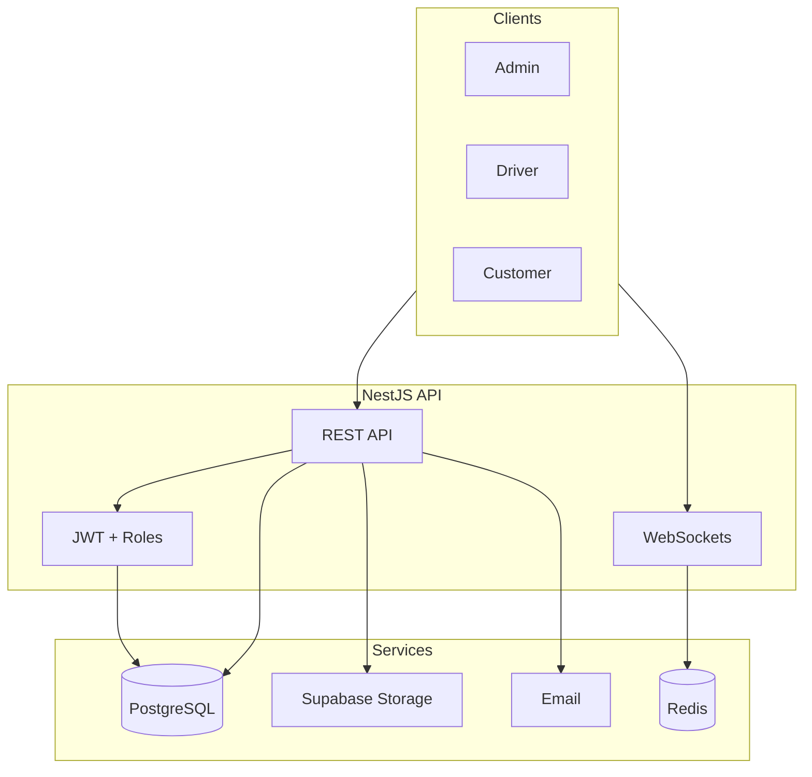

# Delivery Logistics Platform

A modern backend for running last-mile delivery operations — from placing an order to live driver tracking and proof-of-delivery.

Built for **admins**, **drivers**, and **customers** working together on the same delivery network.

---

## At a glance

| | |
|---|---|
| **Base URL** | `http://localhost:3000/api/v1` |
| **Interactive API docs** | [http://localhost:3000/docs](http://localhost:3000/docs) |
| **Authentication** | JWT Bearer token |
| **Real-time** | WebSocket (tracking + notifications) |

---

## Who uses what



### Admin
Create shipments, assign drivers, upload documents, and view company analytics.

### Driver
See assigned routes, update delivery status, share live location, and upload proof-of-delivery photos.

### Customer
Track shipments by code, receive status emails, and view delivery attachments.

---

## Getting started (API integration)

```http
POST /api/v1/auth/register
Content-Type: application/json

{
  "email": "user@example.com",
  "password": "password123",
  "role": "CUSTOMER"
}
```

> New accounts must **verify email** before login. Check your inbox or call `POST /auth/resend-verification`.

```http
POST /api/v1/auth/login
Content-Type: application/json

{
  "email": "admin@leo.com",
  "password": "password123"
}
```

**Response**
```json
{
  "accessToken": "eyJhbG...",
  "user": {
    "id": "...",
    "email": "admin@leo.com",
    "role": "ADMIN",
    "companyId": "..."
  }
}
```

Use the token on every protected request:

```http
Authorization: Bearer eyJhbG...
```

---

## Core features

### Deliveries & tracking

| Action | Endpoint | Who |
|--------|----------|-----|
| Create a delivery | `POST /shipments` | Admin |
| List company deliveries | `GET /shipments` | Admin |
| Track by code | `GET /shipments/track/:trackingCode` | Admin, Driver, Customer |
| Update status | `PATCH /shipments/:id/status` | Admin, Driver |
| Upload photo / PDF | `POST /shipments/:id/attachments` | Admin, Driver |
| View attachments | `GET /shipments/:id/attachments` | Admin, Driver, Customer |

**Shipment lifecycle**



Invalid jumps (e.g. `PENDING` → `DELIVERED`) are rejected automatically.

### Pagination (infinite scroll)

List endpoints return cursor-based pages — ideal for infinite scroll UIs:

- `GET /shipments`
- `GET /notifications`
- `GET /drivers`

**Query params**

| Param | Default | Description |
|-------|---------|-------------|
| `limit` | `20` | Items per page (max 100) |
| `cursor` | — | Pass `meta.nextCursor` from the previous response |

**Response**
```json
{
  "data": [ /* items */ ],
  "meta": {
    "limit": 20,
    "hasMore": true,
    "nextCursor": "eyJjcmVhdGVkQXQiOi..."
  }
}
```

**Infinite scroll example**
```javascript
let cursor = undefined;

async function loadMore() {
  const params = new URLSearchParams({ limit: '20' });
  if (cursor) params.set('cursor', cursor);

  const res = await fetch(`/api/v1/shipments?${params}`, {
    headers: { Authorization: `Bearer ${token}` },
  });
  const page = await res.json();

  appendToList(page.data);
  cursor = page.meta.nextCursor;

  return page.meta.hasMore;
}
```

Stop loading when `hasMore` is `false`.

### Notifications

Customers and drivers receive updates by **email** and **real-time push** when shipment status changes.

| Channel | How to connect |
|---------|----------------|
| Email | Automatic — no client setup |
| Live push | WebSocket namespace `/notifications` |

```javascript
const socket = io('http://localhost:3000/notifications');

socket.emit('join', { userId: '<user-id>' });

socket.on('notification', ({ title, body, payload }) => {
  console.log(title, body, payload);
});
```

### Live driver location

Connect to namespace `/tracking` to follow a shipment on the map.

```javascript
const socket = io('http://localhost:3000/tracking');

// Anyone tracking the order
socket.emit('joinShipment', { trackingCode: 'ABCD1234' });

socket.on('locationUpdate', ({ lat, lng, recordedAt }) => {
  updateMapMarker(lat, lng);
});

// Driver app — send GPS updates
socket.emit('driverLocation', {
  trackingCode: 'ABCD1234',
  shipmentId: '...',
  driverId: '...',
  lat: 40.7128,
  lng: -74.006,
});
```

Works across multiple server instances — no sticky sessions required when Redis is configured.

### Admin analytics

| Endpoint | Returns |
|----------|---------|
| `GET /analytics/overview` | Totals, delivery rate, avg delivery time, driver availability |
| `GET /analytics/shipments/trend?days=30` | Daily created vs delivered chart data |
| `GET /analytics/drivers/performance` | Top drivers by completed deliveries |

Admin role only.

### Account recovery

| Need | Endpoint |
|------|----------|
| Resend verification email | `POST /auth/resend-verification` |
| Forgot password | `POST /auth/forgot-password` |
| Reset password | `POST /auth/reset-password` |

---

## Authentication reference

| Endpoint | Description |
|----------|-------------|
| `POST /auth/register` | Create account |
| `POST /auth/login` | Get JWT |
| `GET /auth/verify-email?token=...` | Confirm email (link from inbox) |
| `POST /auth/resend-verification` | Resend verify email |
| `POST /auth/forgot-password` | Request reset or verify email |
| `POST /auth/reset-password` | Set new password |

---

## File uploads

Attach proof-of-delivery images or PDFs to any shipment.

```http
POST /api/v1/shipments/:id/attachments
Authorization: Bearer ...
Content-Type: multipart/form-data

file: (binary)
type: PROOF_OF_DELIVERY | PICKUP_PHOTO | OTHER
```

- Max size: **5 MB**
- Allowed types: JPEG, PNG, WebP, PDF
- Response includes a **signed download URL**

---

## Error handling

All errors follow a consistent shape:

```json
{
  "statusCode": 400,
  "message": "Invalid status transition from PENDING to DELIVERED",
  "timestamp": "2026-06-20T12:00:00.000Z",
  "path": "/api/v1/shipments/abc/status"
}
```

Login with an unverified email also returns `"emailVerificationRequired": true`.

---

## Health check

```http
GET /api/v1/health
```

Returns database and Redis status — useful for uptime monitoring.

---

## Developer setup

<details>
<summary><strong>Run the API locally</strong></summary>

**Requirements:** Node.js 20+, pnpm, [Supabase](https://supabase.com) project, [Upstash](https://upstash.com) Redis

```bash
pnpm install
cp .env.example .env   # add Supabase, Redis, Mailtrap credentials
pnpm prisma:migrate
pnpm prisma:seed
pnpm start:dev
```

**Key environment variables**

| Variable | Purpose |
|----------|---------|
| `DATABASE_URL` | Supabase PostgreSQL connection |
| `REDIS_URL` | Upstash Redis (queues + WebSocket scaling) |
| `SUPABASE_URL` / `SUPABASE_SERVICE_ROLE_KEY` | Storage uploads |
| `MAIL_*` | Transactional email (Mailtrap for dev) |
| `FRONTEND_URL` | Links in verification & reset emails |
| `WEBSOCKET_REDIS_ADAPTER` | `true` (default) — sync WebSockets across instances |

**Scripts**

```bash
pnpm start:dev      # Dev server
pnpm build          # Production build
pnpm test           # Unit tests
pnpm test:e2e       # End-to-end tests
pnpm prisma:studio  # Database GUI
```

**Architecture**



</details>

---

## Support

- Full request/response schemas: **[Swagger UI → /docs](http://localhost:3000/docs)**
- All protected routes require a valid JWT unless noted otherwise
